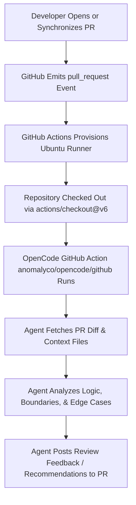

# Project 6: Event-Driven Automated PR Review Loop

## Overview
**Project 6** demonstrates an automated, event-driven agentic code review system built using GitHub Actions and the **OpenCode** AI agent (`anomalyco/opencode/github@latest`). 

Instead of requiring manual reviews, continuous terminal sessions, or polling timers, this system implements an **Event-Driven Heartbeat**—triggering autonomous AI reviews reactively whenever GitHub Pull Request events (`opened`, `synchronize`, `reopened`, `ready_for_review`) or comment triggers (`/oc`, `/opencode`) occur.

---

## Repository Structure

```text
project6-event-driven-review/
├── task1/                                 # Task 1: Python Grading Calculation Review
│   ├── .claude/
│   │   └── skills/
│   │       └── student-grade-fix/
│   │           └── SKILL.md              # Boundary rules and grading specifications
│   ├── src/
│   │   ├── __init__.py
│   │   └── student_result.py             # Target module (boundary bug in grade calculation)
│   ├── tests/
│   │   └── test_student_result.py        # Pytest test suite for grading logic
│   ├── pytest.ini                         # Pytest configuration
│   └── README.md                          # Comprehensive documentation for Task 1
│
├── task2/                                 # Task 2: JavaScript Array Utilities Review
│   ├── array-utils.js                     # Target module (off-by-one bounds & null guard defects)
│   └── README.md                          # Comprehensive documentation for Task 2
│
├── .github/workflows/
│   └── opencode.yml                       # GitHub Actions workflow for event-driven PR review
│
└── README.md                              # Main project documentation (this file)
```

---

## Core Concepts

1. **Event-Driven Heartbeat (Concept 7):**
   - Autonomous agent execution initiated reactively by platform webhooks (e.g., GitHub PR lifecycle events) rather than interactive sessions or cron timers.
   - Zero idle CPU/token consumption when PR activity is dormant.
2. **Connectors & Integrations (Concept 10):**
   - Direct integration of AI agent capabilities into existing developer workflows (GitHub Actions, PR discussion threads, status checks).
3. **Multi-File Context Analysis:**
   - The AI agent inspects PR diffs against requirement specifications, related test cases, and domain logic across multiple languages (Python, JavaScript).

---

## Summary of Tasks

### [Task 1: Python Student Grade Calculation Review](./task1/README.md)
- **Language / Framework:** Python, Pytest
- **Target File:** `task1/src/student_result.py`
- **Context / Specification:** `task1/.claude/skills/student-grade-fix/SKILL.md`
- **Planted Defect:** Strict inequality boundary condition (`average > 90` instead of `>= 90`), causing an exact score of `90` to incorrectly return grade `"B"` instead of `"A"`.
- **Review Outcome:** The agent inspected the source, test suite (`test_student_result.py`), and skill requirements, identified the boundary error, explained the test failure (`test_grade_a`), and provided the correct fix (`>= 90`).

### [Task 2: JavaScript Array Utilities Review](./task2/README.md)
- **Language / Framework:** JavaScript (Node.js / Vanilla JS)
- **Target File:** `task2/array-utils.js`
- **Planted Defects:**
  1. **Off-by-One Error:** Changed upper-bound check from `>= arr.length` to `> arr.length`, leading to index out-of-bounds access on `arr[arr.length]`.
  2. **Removed Null/Undefined Guard:** Removed nullability check, triggering runtime `TypeError` on nullish inputs.
- **Review Outcome:** The agent analyzed the PR diff against `main`, flagged both missing null guards and off-by-one errors with line numbers, posted recommended corrections, and issued a `Request changes` status on the PR.

---

## GitHub Actions Workflow Architecture

The shared review engine is configured at `.github/workflows/opencode.yml`:



### Key Workflow Highlights:
- **Triggers:** Automatically on `pull_request` (`opened`, `synchronize`, `reopened`, `ready_for_review`) and on PR comments containing `/oc` or `/opencode`.
- **Required Permissions:**
  - `pull-requests: write` (to post review comments and reviews)
  - `issues: write` (for issue comment events)
  - `contents: read` & `id-token: write`
- **Model:** Configured with active OpenCode model integration (e.g., `opencode/mimo-v2.5-free`).
- **Secrets Management:** Provider API keys (`OPENCODE_API_KEY`) securely injected via repository secrets.

---

## Comparison of Heartbeat Architectures

Across the engineering loop series, four distinct agent heartbeat patterns were established:

| Project | Heartbeat Type | Mechanism / Trigger | Use Case |
|---|---|---|---|
| **Project 1** | In-Session Heartbeat | Interactive loop within active CLI | Real-time interactive coding |
| **Project 2** | Conditional / Run-Until-Done | Loop until exit condition/tests pass | Automated bug-fixing & TDD |
| **Project 3** | Scheduled Heartbeat | Time-based periodic Cron | Regular audits & health checks |
| **Project 6** | **Event-Driven Heartbeat** | **Reactive triggers from Git/PR events** | **Autonomous CI/CD PR reviews** |

---

## How to Run & Verify

1. **Configure Repository Secret:**
   - Add `OPENCODE_API_KEY` under repository **Settings > Secrets and variables > Actions**.
2. **Create Feature/Bug Branch:**
   ```bash
   git checkout -b bug/test-review-branch
   ```
3. **Introduce Change & Push:**
   - Modify target files in `task1/` or `task2/`, commit, and push branch to GitHub.
4. **Open Pull Request:**
   - Create a PR against `main`.
   - Monitor the **Actions** tab for the `opencode` workflow run.
   - Verify the automated AI review comments and proposed fixes in the PR conversation tab.
