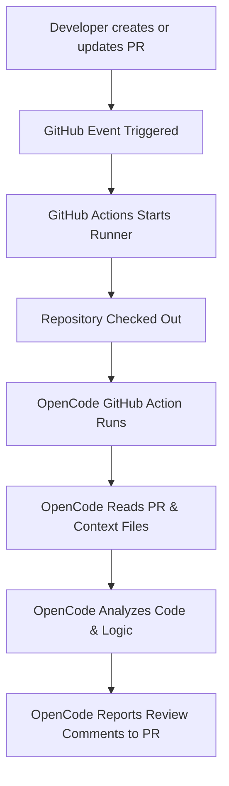

# Project 6 — Task 1: Event-Driven PR Review

## Overview
This task demonstrates an automated, event-driven Pull Request (PR) code review workflow using:
- **GitHub Pull Request events:** Webhooks emitted when PRs or comments are created/updated.
- **GitHub Actions:** CI/CD automation runner executing on repository events.
- **OpenCode GitHub agent (`anomalyco/opencode/github@latest`):** An AI-driven agent running inside the GitHub Actions pipeline.
- **Automated PR Code Review:** Hands-free code analysis identifying defects, edge cases, and boundary condition errors before merging.
- **Event-Driven Agent Workflow:** Autonomous triggering, repository inspection, analysis, and feedback reporting without manual developer intervention.

---

## Objective
The purpose of this task is to establish an automated review loop that continuously inspects PR diffs and codebase context. By embedding the OpenCode agent into GitHub Actions, issues such as incorrect boundary conditions and logic bugs are caught automatically right when a PR is opened or synchronized, shifting bug detection left in the development lifecycle.

---

## Architecture / Flow

The event-driven review workflow executes through the following lifecycle:



### Execution Steps:
1. **Developer creates or updates a PR:** Code changes are pushed to a branch with an open pull request.
2. **GitHub event triggers workflow:** GitHub emits `pull_request` (or comment) events matching workflow criteria.
3. **GitHub Actions starts:** A fresh `ubuntu-latest` runner instance is provisioned.
4. **Repository is checked out:** `actions/checkout@v6` checks out the repository contents.
5. **OpenCode action executes:** `anomalyco/opencode/github@latest` starts up with configured parameters and credentials.
6. **Context fetching:** OpenCode reads the PR diff along with related files (`student_result.py`, `test_student_result.py`, and `SKILL.md`).
7. **Code analysis:** The agent evaluates implementation logic against requirements and test expectations.
8. **Feedback reporting:** Findings and recommendations are reported back directly to the PR discussion.

---

## Repository Structure

The actual file structure for Task 1:

```text
project6-event-driven-review/task1/
├── .claude/
│   └── skills/
│       └── student-grade-fix/
│           └── SKILL.md
├── src/
│   ├── __init__.py
│   └── student_result.py
├── tests/
│   └── test_student_result.py
├── pytest.ini
└── README.md
```

- **`src/student_result.py`**: Implementation containing the grading calculation logic.
- **`tests/test_student_result.py`**: Pytest test suite asserting expected grade boundary behaviors.
- **`.claude/skills/student-grade-fix/SKILL.md`**: Specification defining grading boundary requirements and fix procedures.
- **`pytest.ini`**: Pytest configuration file.

---

## GitHub Actions Workflow

The automated review is configured in `.github/workflows/opencode.yml`:

```yaml
name: opencode

on:
  pull_request:
    types: [opened, synchronize, reopened, ready_for_review]

  issue_comment:
    types: [created]

  pull_request_review_comment:
    types: [created]

jobs:
  opencode:
    if: |
      github.event_name == 'pull_request' ||
      contains(github.event.comment.body, ' /oc') ||
      startsWith(github.event.comment.body, '/oc') ||
      contains(github.event.comment.body, ' /opencode') ||
      startsWith(github.event.comment.body, '/opencode')

    runs-on: ubuntu-latest

    permissions:
      id-token: write
      contents: read
      pull-requests: write
      issues: write

    steps:
      - name: Checkout repository
        uses: actions/checkout@v6
        with:
          persist-credentials: false

      - name: Run opencode
        uses: anomalyco/opencode/github@latest
        env:
          OPENCODE_API_KEY: ${{ secrets.OPENCODE_API_KEY }}
          GITHUB_TOKEN: ${{ secrets.GITHUB_TOKEN }}
        with:
          model: opencode/mimo-v2.5-free
          use_github_token: true
          prompt: |
            Review this pull request.

            Check for:
            - bugs
            - incorrect boundary conditions
            - logic errors
            - test failures
            - code quality issues

            Pay special attention to the grading logic and verify
            that all boundary values behave according to the expected
            requirements.
```

### Key Configuration Points:
- **Workflow Name:** `opencode`
- **Triggers:**
  - `pull_request`: `[opened, synchronize, reopened, ready_for_review]`
  - `issue_comment`: `[created]`
  - `pull_request_review_comment`: `[created]`
- **Command Handling:** Job runs automatically on PR events or when a comment contains/starts with `/oc` or `/opencode`.
- **Permissions:**
  - `id-token: write`
  - `contents: read`
  - `pull-requests: write` (required to post comments/reviews to PRs)
  - `issues: write` (required for issue comment interaction)
- **Checkout Step:** `actions/checkout@v6` with `persist-credentials: false`.
- **Action & Model:** `anomalyco/opencode/github@latest` using `model: opencode/mimo-v2.5-free`.
- **Secret Integration:** Authenticated via `secrets.OPENCODE_API_KEY` and default `secrets.GITHUB_TOKEN`.

---

## Secret Configuration

The OpenCode API key is stored securely as a GitHub repository secret:
- **Secret Name:** `OPENCODE_API_KEY`
- **Workflow Reference:** `${{ secrets.OPENCODE_API_KEY }}`

> **Security Note:** Secrets are never hardcoded or printed in logs. They are injected at runtime via environment variables into the runner.

---

## How It Works

1. A developer creates a Pull Request introducing or modifying code in the repository.
2. GitHub detects the PR event and matches the trigger in `.github/workflows/opencode.yml`.
3. GitHub Actions spins up an Ubuntu container and checks out the branch code.
4. The OpenCode action launches the AI agent with instructions to review the diff and verify grading boundary conditions.
5. The agent parses the source code (`student_result.py`), test assertions (`test_student_result.py`), and specification (`SKILL.md`).
6. The agent detects any logic discrepancies or boundary condition mismatches.
7. The agent posts a detailed review comment back to the GitHub PR outlining the problem and how to resolve it.

---

## Test / Verification

During Task 1 verification, the event-driven review was validated against a planted boundary-condition bug:

1. **Workflow Triggered:** Triggered from PR events on branch updates.
2. **Repository Checkout:** Checked out repository files successfully.
3. **PR Information Fetched:** Diff and context fetched by the action.
4. **Files Inspected:**
   - `project6-event-driven-review/task1/src/student_result.py`
   - `project6-event-driven-review/task1/tests/test_student_result.py`
   - `project6-event-driven-review/task1/.claude/skills/student-grade-fix/SKILL.md`
5. **Defect Identified:** Correctly pinpointed that `average > 90` fails for a score of exactly `90`.
6. **Detailed Review Posted:** Generated explanation of the boundary error, impact on test `test_grade_a`, and recommended fix (`>= 90`).
7. **Job Completed:** GitHub Actions run completed with green status.

> **Important Distinction:** The OpenCode GitHub Action performed **automated bug detection and code review**. It did **not** modify or push changes to the source code file itself; code modification remains in developer control under this review pattern.

---

## Example Detected Bug

### Comparison:

**Before (Current in PR branch):**
```python
def calculate_grade(average):
    if average > 90:
        return "A"
    elif average >= 80:
        return "B"
    ...
```

**After (Recommended Fix):**
```python
def calculate_grade(average):
    if average >= 90:
        return "A"
    elif average >= 80:
        return "B"
    ...
```

### Why the Bug Occurs:
In `src/student_result.py`, the condition `average > 90` strictly requires values greater than 90 (e.g., 90.1, 91). An input of exactly `90` evaluates to `False` on the first branch, falling through to `elif average >= 80:`, which incorrectly returns `"B"` instead of `"A"`. This contradicts the requirement specified in `SKILL.md` ("90 or above must return A") and fails `test_student_result.py::test_grade_a`.

---

## Lessons Learned

- **Event-Driven Automation:** Automating reviews via PR events eliminates manual review bottlenecks and provides immediate feedback to developers.
- **GitHub Actions as Event Trigger:** Fine-grained event filters (`pull_request`, `issue_comment`) enable both fully automatic runs and on-demand `/oc` invocations.
- **Agentic Code Review:** LLM-powered review agents can understand multi-file context (tests + source + skills) to spot subtle semantic and boundary errors.
- **Permissions Management:** Workflows writing PR comments require explicit `pull-requests: write` and `issues: write` permissions in the GitHub Actions token configuration.
- **Secret Hygiene:** Passing credentials via repository secrets ensures secure interaction with LLM providers.
- **Human Oversight & Feedback Loops:** Distinguishing between code review and automated code mutation allows developers to retain control over merge decisions.

---

## Troubleshooting

During setup and testing, the following issues were encountered and resolved:

### 1. GitHub API 403 Permission Error
- **Symptom:** OpenCode failed when trying to post comments or update the PR status.
- **Root Cause:** Default `GITHUB_TOKEN` lacked write permissions for pull requests and issues.
- **Fix:** Added explicit `permissions` block in `.github/workflows/opencode.yml`:
  ```yaml
  permissions:
    id-token: write
    contents: read
    pull-requests: write
    issues: write
  ```

### 2. OpenCode Model Not Found Error
- **Symptom:** Workflow failed with model initialization/availability errors.
- **Root Cause:** The initially configured model `opencode/mimo-v2-flash-free` was deprecated or unavailable in the provider catalog.
- **Fix:** Updated the model configuration in `.github/workflows/opencode.yml` to the active model:
  ```yaml
  with:
    model: opencode/mimo-v2.5-free
  ```

---

## Result

**Task 1 Status: Successfully Completed and Verified**

The automated event-driven PR review pipeline using OpenCode and GitHub Actions is fully operational. It triggers reliably on PR events, reads repository context, accurately detects grading boundary bugs, and reports constructive review comments back to the PR.

---

## Future Improvements

- **Automated Pre-Review Test Runs:** Run `pytest` inside the workflow step and provide test failure logs directly in the agent's review context.
- **Richer Review Comments:** Leverage GitHub Suggested Changes markdown syntax (`suggestion`) so developers can apply fixes with a single click.
- **Automated Fix Branching:** Add an opt-in command (e.g., `/oc fix`) that allows the agent to open a fix PR with automated test validation.
- **Additional PR Quality Checks:** Extend review prompts to check for security vulnerabilities, docstrings, and typing annotations.
- **Human Approval Safeguards:** Require team lead approval before automated suggestions can be merged into production branches.
